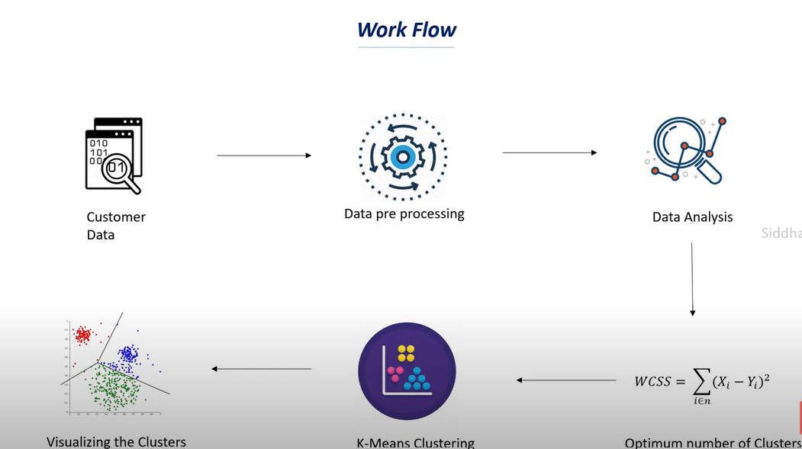

# Customer-Segmentation-using-K-Means-Clustering

This project demonstrates how to segment customers using K-Means Clustering, an unsupervised machine learning algorithm. The customer segmentation analysis, also known as Market Basket Analysis, helps businesses identify and group customers with similar behaviors, which is valuable for targeted marketing strategies.

**Dataset**

The dataset contains basic information about customers who are members of a supermarket. The data includes:
Customer ID,
Age,
Gender,
Annual Income,
Spending Score (assigned based on customer behavior and purchasing data).

**Data Context**

The dataset is designed for learning purposes and focuses on customer segmentation. It is ideal for understanding how to group customers into segments based on shared attributes like income and spending behavior.

**Problem Statement**

As a mall owner, you want to understand your customer base and identify target customers for marketing campaigns. Using the data collected from membership cards, the objective is to segment customers who are more likely to convert, enabling the marketing team to plan and execute targeted strategies.

**Workflow**

**Data Collection:**
Customer data including ID, age, gender, income, and spending score.
**Data Preprocessing:**
Cleaning and preparing the data for analysis.
**Data Analysis:**
Exploratory analysis to understand the distribution of data.
**K-Means Clustering:**
Apply the K-Means algorithm to segment customers based on the available features.
**Optimum Clusters:**
Calculate the Within-Cluster Sum of Squares (WCSS) to determine the optimal number of clusters.
**Cluster Visualization:**
Visualize the clusters for better understanding and interpretation.

**Features**
Customer Segmentation: Segment customers based on their demographic and spending behavior.
Cluster Visualization: Visualize the groups of customers using various plotting techniques.
WCSS Calculation: Calculate the WCSS to find the optimum number of clusters for K-Means.

**Technologies Used**

Python

Pandas

NumPy

Matplotlib

Seaborn

Scikit-learn (for K-Means Clustering)
